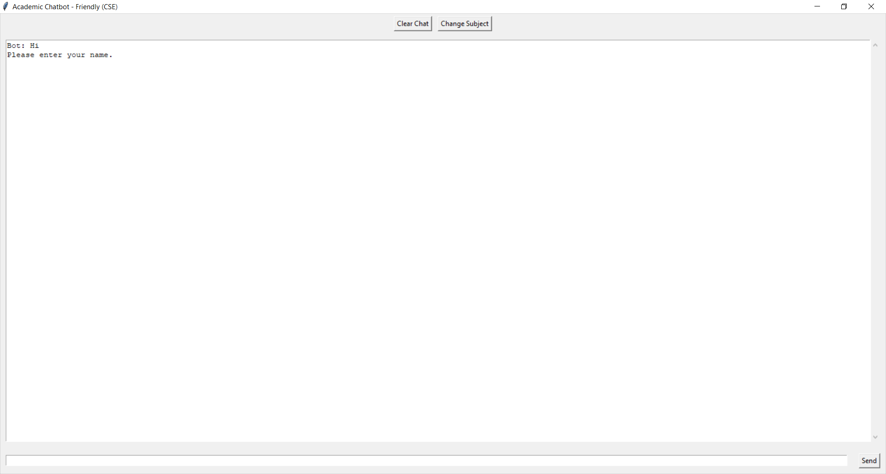

# 🎓 Academic Chatbot

<p align="center">
  <b>An NLP-powered Academic Chatbot built using Python, Machine Learning and Tkinter</b>
</p>

<p align="center">
  
  
  
  
  
  
</p>

---

## 📌 About The Project

**Academic Chatbot** is a desktop-based chatbot developed using **Python, Natural Language Processing (NLP), Machine Learning and Tkinter**.

The chatbot is designed to help Computer Science students with academic questions from different core subjects through a simple and interactive graphical interface.

The system uses **TF-IDF vectorization and Logistic Regression** for intent classification, along with **cosine similarity** as a fallback mechanism for matching user queries.

---

## ✨ Features

- 🎓 Student information collection
- 🔢 Enrollment number identification
- 💻 Branch selection
- 📚 Subject-based academic assistance
- 🤖 NLP-based intent classification
- 📊 TF-IDF text vectorization
- 🧠 Logistic Regression classification
- 🔍 Cosine similarity fallback
- 🖥️ Tkinter desktop GUI
- 🔄 Change Subject functionality
- 🧹 Clear Chat functionality
- 💬 Interactive chatbot conversation
- 📦 Pre-trained machine learning model

---

## 📸 Screenshots

### 🖥️ Main Interface

<p align="center">
  
</p>

---

### 💬 Chatbot Conversation

<p align="center">
  
</p>

---

### 📚 New Subject Conversation

<p align="center">
  
</p>

---

### 🔄 Change Subject

<p align="center">
  
</p>

---

## 📚 Supported Subjects

The chatbot currently supports academic queries related to:

| Subject | Code |
|---|---|
| Database Management Systems | DBMS |
| Operating Systems | OS |
| Computer Networks | CN |
| Data Structures & Algorithms | DSA |
| Object-Oriented Programming | OOP |
| Artificial Intelligence | AI |
| Computer Architecture | CA |

---

## 🧠 How It Works

```text
User Question
      ↓
Text Processing
      ↓
TF-IDF Vectorization
      ↓
Logistic Regression
      ↓
Intent Prediction
      ↓
Confidence Check
      ↓
Cosine Similarity Fallback
      ↓
Response Selection
      ↓
Chatbot Response
